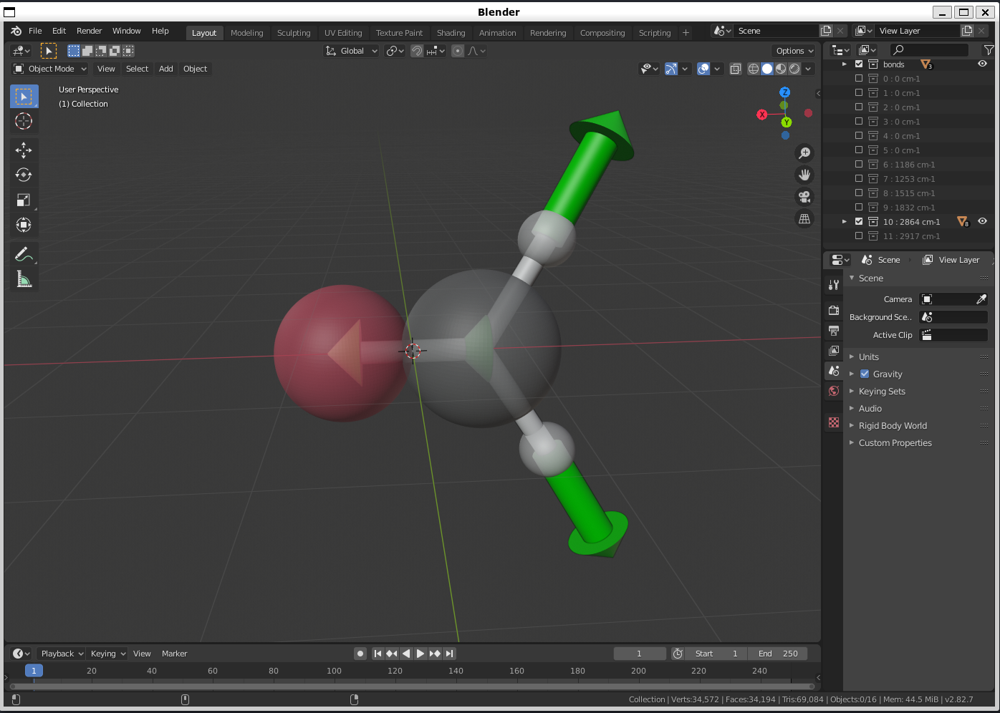

# PyVibLocalizer
**visualize atomic mode and genetrate displacement vectors (normal/local mode, arbitary path)**



- [Documentation](https://kenhino.github.io/PyVibLocalizer/index.html#)

## Installation
```bash
$ git clone https://github.com/KenHino/PyVibLocalizer
```

- In WSL2 or Ubuntu,
```bash
$ sudo apt install blender
```
- In Mac, 
```bash
$ brew install --cask blender
```

or simply install from [homepage](https://www.blender.org/). 

- First, modify PATH related to blender in `CMakeLists.txt` in PyVibLocalizer directory. Below is an example of PATH in Mac OS. (In Ubuntu, this may be `/usr/bin/blender`)
```cmake
set(BPython "/Applications/Blender.app/Contents/Resources/3.5/python/bin/python3.10")
set(BPythonDir "/Applications/Blender.app/Contents/Resources/3.5/python/")
set(Blender "/Applications/Blender.app/Contents/MacOS/Blender")
```

- Next, move to `test` directory and make `build` directory. And execute `cmake`.
```bash
$ cd test
$ mkdir build
$ cd build
$ cmake ../..
```

- At last, activate virtual environment and execute a some example file such as `work/ch2o.py`.
```bash
$ source venv/bin/activate
$ blender --python main.py
```

- And you can also use jupyter notebook in blender. 
```bash
$ jupyter-lab
```
In jupyter notebook, you can use `blender_kernel` to execute blender script. 


## Local mode
[J. Chem. Phys. 130, 084106 (2009)](https://doi.org/10.1063/1.3077690)

- Pipek-Mezy metric

$$\xi_{\mathrm{at}}\left(\widetilde{\boldsymbol{Q}}^{\mathrm{sub}}\right)=\sum_{p=1}^{k} \sum_{i=1}^{n}\left(\tilde{C}_{i p}^{\mathrm{sub}}\right)^{2}$$

$$\tilde{C}_{i p}^{\mathrm{sub}}=\sum_{\alpha=x, y, z}\left(\tilde{Q}_{i \alpha, p}^{\mathrm{sub}}\right)^{2}$$

- Boys metric

$$\xi_{\mathrm{dist}}\left(\widetilde{\boldsymbol{Q}}^{\mathrm{sub}}\right)=\sum_{p=1}^{k}\left(\boldsymbol{R}_{p}^{\text {center }}\right)^{2}$$

$$\boldsymbol{R}_{p}^{\text {center }}=\sum_{i=1}^{n} \tilde{C}_{i p}^{\mathrm{sub}} \boldsymbol{R}_{i}$$

To maximize, metrices, this program used `scipy.optimized.minimize_scalar`, in jacobi sweep method. The choice of unitary rotation mode pair is based on window frequency.: [J. Chem. Phys. 145, 124112 (2016)](https://doi.org/10.1063/1.4963109) Default window frequency set as 400 cm-1.

## Group Localized Coordinate
Group localized coordinate is one of the local mode, which diagonalize subspace mass-weighted hessian whose subspace is defined by your selction of atoms.


## Quick Start
- See [here](https://kenhino.github.io/PyVibLocalizer/quick_start.html)
- To run this program, execute `python {$mol_name}.py` or `blender --python {$mol_name}.py` (example; mol_name=src/ch2o) 
