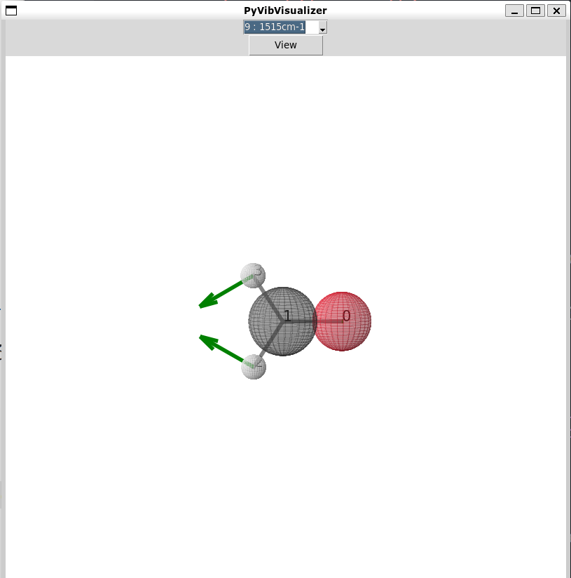

.. PyVibLocalizer documentation master file, created by
   sphinx-quickstart on Tue Apr  5 08:26:46 2022.
   You can adapt this file completely to your liking, but it should at least
   contain the root `toctree` directive.

Hello, vibration!
==========================================

.. toctree::
   :maxdepth: 2
   :caption: Contents:

   ./README.md
   
   pyvib
   visual_cls
   local_cls
   units
   blender

Indices and tables
==================

* :ref:`genindex`
* :ref:`modindex`
* :ref:`search`
